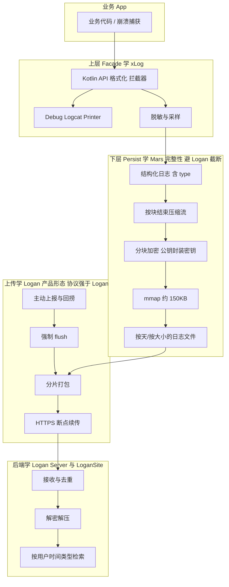
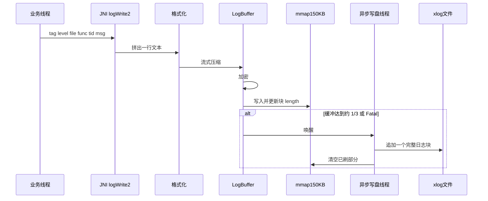
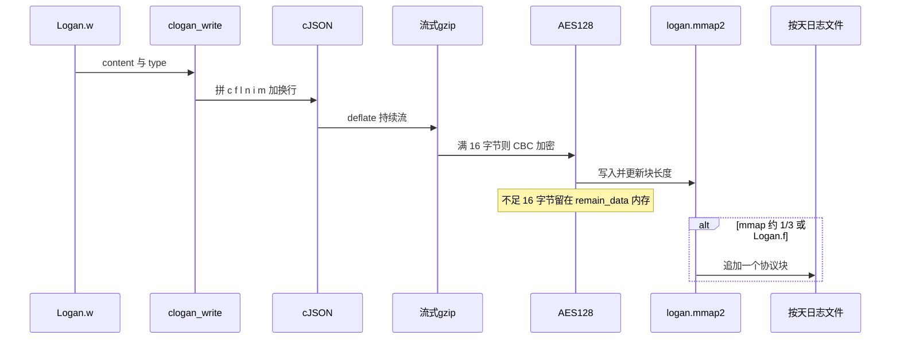
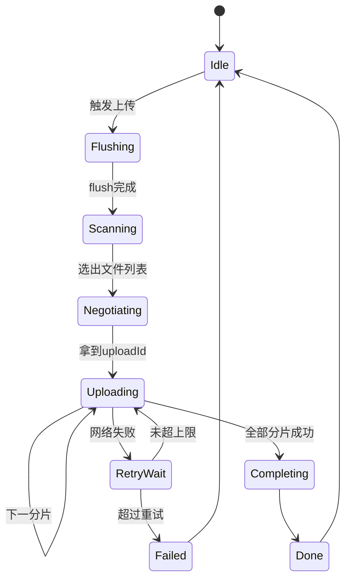

# Android 自研日志框架：Mars / Logan / xLog 分析与实现计划

> 范围：首期仅 Android。**已选定方案 4（Kotlin 自研内核）**。本计划只做分析、架构与分期实现路径，不写具体代码。
> 工作区 `[D:\工作文档\APP规划\日志系统设计](D:\工作文档\APP规划\日志系统设计)` 目前为空，后续落地时在此产出设计文档与工程。

---

## 0. 先澄清三个容易混在一起的名字

[Tencent/mars](https://github.com/Tencent/mars) 的 **xlog**、[Meituan-Dianping/Logan](https://github.com/Meituan-Dianping/Logan)、[elvishew/xLog](https://github.com/elvishew/xLog) **不是同一类东西**：

- **Mars xlog**：微信终端基础组件里的 **生产级落盘内核**（C++ / JNI）。目标：Release 也能打、杀进程尽量不丢、压缩加密。开源 **不含上传与后台**。
- **美团 Logan**：面向 **个案分析** 的大前端日志体系。开源包含 Android/iOS C 内核、内置上传、Java Server、LoganSite 可视化，以及 Web/Flutter。落盘思路与 Mars 同族（mmap + 先压缩后加密），产品形态比 Mars 完整。
- **elvishew xLog**：纯 Java 的 **调试门面**。Logcat 好看、API 灵活。`RemotePrinter` 是空实现，不能当线上方案。

自研不应三选一，而应 **分层取长**：上层像 xLog，落盘完整性和密钥设计像 Mars，上传/类型/查询像 Logan。

---

## 1. Mars 整体功能（先看全貌，再聚焦日志）

Mars 是微信团队用 C++ 写的 **跨平台终端基础组件**，不是“一个日志库”。官方拆成四块：

| 模块       | 职责                           | 和自研日志的关系                                                 |
| -------- | ---------------------------- | -------------------------------------------------------- |
| **comm** | socket、线程、消息队列、协程、文件/mmap 封装 | xlog 依赖它，自研可只借鉴 mmap/线程思路                                |
| **xlog** | 高性能可靠日志                      | **本计划的核心参考**                                             |
| **SDT**  | 网络诊断（连通性探测）                  | 日志上传可选用，非必须                                              |
| **STN**  | 长短连信令通道，面向小数据包、弱网            | **不要用 STN 传日志文件**。官方明确：不适合大数据、不完整支持 HTTP。日志上传应走 HTTPS 分片 |

当前 Maven 产物约 `com.tencent.mars:mars-xlog:1.2.5`。可单独只引 xlog，不必引入 STN。

官方定位：**日志行为全部发生在终端，和服务端无绑定；开源里不含上报。** 微信自己的回捞是业务层（用户指令 / 服务端下发）完成的。

---

## 2. Mars xlog 要实现的四个硬指标

微信从早期“每条 Java 日志加密写文件”演进到 xlog，是因为那套方案 **Release 不敢开日志**：频繁 IO、GC、卡顿。xlog 的设计目标可概括为四件事，彼此互相打架，必须一起权衡：

1. **流畅性**：打日志不能卡 UI，也不能出现 CPU 尖峰。
2. **完整性**：被系统杀、未捕获崩溃、没有 `onDestroy` 时，尽量不丢最后几条日志。
3. **容错性**：文件局部损坏时，只损失一个压缩块，而不是整文件报废。
4. **安全性**：落盘不是明文；但规范比算法更重要——**不要把隐私打进日志**。

这四条应直接成为自研框架的验收标准，而不是“能写出文件就算完成”。

---

## 3. Mars xlog 方案演进（实现逻辑的主线）

### 3.1 V1：内存缓冲 + 攒一批再压缩加密写文件

- 业务线程把日志写入内存 buffer。
- 达到阈值后，整块 zlib 压缩、加密、`write()` 到文件。
- **优点**：比每条都 `write()` 流畅。
- **致命缺点**：
  - 进程被杀时，buffer 里的日志丢失；而线上最难查的往往就是这次异常退出。
  - 集中压缩造成 CPU 尖峰。
  - 一块损坏会拖累整块压缩数据。

Android 早期曾用 ashmem 共享内存缓解丢失，4.0 后权限收紧，不再可靠。

### 3.2 V2（现行）：单行流式压缩加密 + mmap 中转 + 条件刷文件

最终方案一句话：

**每条日志先流式压缩、再加密，写入 mmap 映射的 150KB 缓冲区；缓冲区到阈值或 Fatal / 主动 flush 时，再追加到按天（可选按大小）的 `.xlog` 文件。**

官方测试口径：流式压缩率约 **83.7%**（V1 整块压缩约 86.3%），换来 CPU 平滑和损坏隔离。mmap 写入性能接近纯内存，同时进程退出时内核会把脏页回写到 mmap 文件。

---

## 4. Mars xlog 关键实现逻辑（按调用链）

以下对应仓库中的核心路径（版本间目录略有调整，逻辑稳定）：

- Java 入口：`[mars/libraries/mars_android_sdk/src/main/java/com/tencent/mars/xlog/Xlog.java](https://github.com/Tencent/mars/blob/master/mars/libraries/mars_android_sdk/src/main/java/com/tencent/mars/xlog/Xlog.java)`、`Log.java`
- JNI：`Java2C_Xlog.cc` → `appender_open` / `logWrite2`
- 落盘：`log/src/appender.cc`（或等价 `appender.cc`）
- 缓冲：`LogBuffer` / `LogZlibBuffer` / `LogZstdBuffer`
- 加解密：`log_crypt.cc` + `mars/xlog/crypt/decode_mars_*.py`

### 4.1 初始化 `appenderOpen`

配置结构（`XLogConfig`）要点：

- `mode`：异步（Release 必须）/ 同步（Debug 可用，可能卡顿）
- `logdir`：**必须独占目录**，启动清理会删目录内过期文件
- `cachedir`：建议放应用私有目录，例如 `/data/data/<pkg>/files/xlog`。SD 卡不可写时回落到此；官方强调 **cachePath 为空可能导致 SIGBUS**
- `nameprefix`：文件名 `TEST_20170102.xlog`
- `cache_days`：缓存目录保留天数；非 0 时日志会在 cache 目录多留几天再挪到 logdir
- `pub_key`：ECDH 公钥，空则不加密
- `compress_mode`：zlib 或 zstd
- 级别：Debug 常用 `LEVEL_DEBUG`，Release 常用 `LEVEL_INFO`

初始化后还会：

1. 创建 mmap 文件：`{cacheDir或logDir}/{prefix}.mmap3`，大小 `**kBufferBlockLength = 150 * 1024**`。
2. mmap 失败则退化为普通 150KB 堆内存（此时杀进程会丢缓冲）。
3. **立刻 Flush 上一次生命周期残留的 mmap 数据** 到 `.xlog`（源码里会打 `~~~~~ begin of mmap ~~~~~` 标记）。这是“不丢日志”的关键。
4. 延迟约 2 分钟启动过期清理（默认约 10 天，`kMaxLogAliveTime`），约 3 分钟把 cache 中旧文件搬到 logdir。
5. 异步模式启动后台写盘线程。

多进程：**每个进程必须独立日志文件**，否则 mmap/文件互踩。

### 4.2 写一条日志

细节：

- 业务线程只操作内存映射地址，**不直接 `write()` 大文件**。
- 单条日志官方限制约 **16KB**，超出会被截断。
- 缓冲使用约 **1/3** 容量唤醒刷盘，约 **4/5** 时打内部告警，避免写满堵死。
- Fatal 级别立即触发刷盘。
- 异步线程把 mmap 中“已形成完整块”的数据拷到 `AutoBuffer`（去掉尾部空洞）再追加文件。
- 同步模式：每条日志直接组成一个独立块写入文件，更不容易丢，但更容易卡。

### 4.3 磁盘文件格式（容错的关键）

每个日志块（异步时 mmap 里同时只有一个正在增长的块）：

`magic_start(1) | seq(2) | begin_hour(1) | end_hour(1) | length(4) | crypt_key(4) | payload | magic_end(1)`

- **magic**：同时承担 **版本号 + 模式识别**（同步/异步、是否加密、zlib/zstd）。解码脚本靠它选算法。
- **length**：异步模式下每追加一行都更新，便于崩溃后知道有效载荷长度。
- **payload**：先压缩后加密的数据。
- 不可去掉的字段：`magic_start`、`length`、`payload`、`magic_end`。损坏时解码器按 magic 扫描下一个合法块，实现局部容错。

加密默认 **ECDH 协商 + TEA**。客户端用服务端公钥，服务端用私钥解出 TEA key。压缩必须在加密之前。

解码工具：`decode_mars_crypt_log_file.py` / `decode_mars_nocrypt_log_file.py`。自研必须同步维护 **编码器与解码器**，否则文件等于废文件。

### 4.4 文件滚动与清理

- 默认 **按天** 一个文件：`{prefix}_{yyyyMMdd}.xlog`。
- 后期支持 `setMaxFileSize`，超限后 `prefix_date_index.xlog`。
- 清理按 **修改时间**，不按总大小；所以必须独占目录。
- 上传前必须 `appenderFlush(true)`，否则最新日志仍在 mmap 里。

### 4.5 Mars 明确不做的事

- **不上报、不传文件**（隐私与业务绑定）。
- **不负责 Crash 捕获**（与 Bugly 互补；崩溃堆栈应另模块，但应写入同一套日志）。
- **不建议日志进 SQLite**。
- STN 不是日志通道。

微信侧上报经验（开源问答，值得直接抄进自研上传设计）：

- 失败要重试，但要有上限。
- 文件大，要分片，最好断点续传。
- 服务端入库可用多线程加速。
- 日常日志应静默留在端上到期删除；**用户反馈或服务端指令才回捞**。Crash 必须上报。

---

## 5. elvishew/xLog 功能与实现逻辑

### 5.1 它解决什么

面向 **开发体验**：Logcat 美化、JSON/XML 格式化、对象 dump、堆栈/线程/边框、拦截器、多 Printer。依赖 `com.elvishew:xlog:1.11.1`，纯 JVM，无 JNI。

### 5.2 架构

`XLog` 全局门面 → `Logger` → `Interceptor[]` 可改写或丢弃 `LogItem` → 多个 `Printer.println(level, tag, msg)`。

内置 Printer：

- `AndroidPrinter`：logcat，处理 4KB 截断
- `ConsolePrinter`：`System.out`
- `FilePrinter`：明文文件
- `RemotePrinter`：**空实现**

`FilePrinter` 实现要点：

- 默认后台 `BlockingQueue` + 单 Worker 异步写。
- `FileNameGenerator` / `BackupStrategy` / `CleanStrategy` / `Flattener` / `Writer` 全部可替换。
- 默认备份：约 1MB 切分，且默认只留当前 + 1 个 bak，最多约 2MB。
- 默认 `NeverCleanStrategy`，目录会涨。
- `LogUtils.compress()` 只是把目录打 zip，**不是流式压缩，也不是上传**。
- 进程被杀时，队列和未 fsync 的数据会丢。
- 明文落盘，无 mmap、无按条加密。

上层还有：全局/单条配置、黑白名单拦截器、`ObjectFormatter`、与 `android.util.Log` 兼容的 `XLog.Log`、`LibCat` 劫持第三方 `Log`。

### 5.3 它的本质

xLog 是 **日志门面 + 调试输出框架**，不是 **可靠的线上日志系统**。适合 Debug；Release 文件日志在完整性、体积、安全上都不达标。

---

## 6. 美团 Logan：功能、实现逻辑与和 Mars 的关键差异

仓库：[Meituan-Dianping/Logan](https://github.com/Meituan-Dianping/Logan)（MIT）。名称是 Log + An（个体日志），也呼应金刚狼。Maven：`com.dianping.android.sdk:logan:1.2.4`（文档亦见 1.2.5 量级）。

必须先把 **开源 Logan** 和 **美团内部 Logan** 分开：

- **开源版（2018 起）**：C 内核 Clogan + Android/iOS SDK + 简易 Java Server + LoganSite + 后来的 Web/Flutter。定位是「个案分析」闭环，不是实时全量流水线。
- **美团内部后续（2022 文《高性能终端实时日志系统》）**：配置中心、限流、ECDH+AES、失败落盘重传、ES 查询等。这些 **大部分不在开源仓库里**。自研不要按内部宣传规格去期待开源包。

### 6.1 Logan 要解决的产品问题（比内核更重要）

美团的出发点不是「再做一个 mmap 日志库」，而是 **日志孤岛**：代码日志、网络日志、行为日志、崩溃、H5 各走各的系统，采样不全、上报不及时、排障要对着多个后台拼现场。

Logan 的产品主张：

1. 端上 **不采样、尽量写全**，需要时再统一上报（省电省流量）。
2. 用 **type** 区分种类，分析时按用户 + 时间窗聚合，而不是按系统拼。
3. 客服引导 **主动上报**，或 Push **回捞**；研发在 LoganSite 按时间轴/类型筛选还原现场。

这对自研的启示：内核只是一半，**类型约定 + 回捞 + 后台按用户查** 才是排障效率。Mars 开源故意不做后半段；elvishew xLog 也没有。

### 6.2 开源组件与职责

| 组件              | 路径/形态                                                                                  | 职责                                                       |
| --------------- | -------------------------------------------------------------------------------------- | -------------------------------------------------------- |
| **Clogan**      | `[Logan/Clogan](https://github.com/Meituan-Dianping/Logan/tree/master/Logan/Clogan)` C | mmap、gzip、AES、按天文件，Android/iOS 共用                        |
| **Android SDK** | `Example/Logan-Android`，`Logan.w/f/s`                                                  | JNI 封装、按日期上传、拷贝后再传                                       |
| **iOS SDK**     | `Logan/iOS`                                                                            | 同样走 Clogan                                               |
| **Web SDK**     | `logan-web` npm                                                                        | 浏览器本地存 + `report({reportUrl, deviceId, fromDay, toDay})` |
| **Server**      | `Logan/Server` Spring + MySQL                                                          | 收文件、解密解压、任务表 + 明细表                                       |
| **LoganSite**   | 前端                                                                                     | 列表筛选、日志详情、按 type 展示                                      |
| **Flutter**     | 插件                                                                                     | 桥到原生 SDK                                                 |

依赖：压缩用 zlib，加密用 **mbedtls**，JSON 用 **cJSON**。源码编译 Android 时官方要求 **NDK r16b**，环境偏旧。

### 6.3 Android 使用与调用链

初始化（**必须**带 16 字节 Key 和 IV，否则 `clogan_init` 失败）：

- `cachePath`：mmap 所在目录，建议内部 files
- `path`：正式日志目录（示例用 `externalFilesDir/logan_v1`）
- `setEncryptKey16` / `setEncryptIV16`

写日志：`Logan.w(content, type)`。type 是业务分类整数，**不是** V/D/I/W/E。官方说明 **type=1 已被内部占用**，业务应避开。

立刻落盘：`Logan.f()` → `clogan_flush()`。官方建议崩溃、退出、进后台时手动 flush。

查看：`Logan.getAllFilesInfo()` → 日期 → 字节大小。

上传两条路径：

1. **内置**：`Logan.s(url, date, appId, unionId, deviceId, buildVersion, appVersion, callback)`，默认打到类似 `/logan/upload.json`。
2. **自定义**：实现 `SendLogRunnable.sendLog(File)`，传的是预处理后的文件；**必须 `finish()`**；若文件名含 `.copy` 应删除拷贝。

回捞在开源 SDK 里 **没有 Push 实现**，只有「按日期把文件发出去」的能力。美团内部回捞依赖集团 PushSDK，开源使用者要自己接推送再调 `Logan.s`。

### 6.4 C 内核写盘逻辑（对照 Mars）

核心文件：`clogan_core.c`、`construct_data.c`、`zlib_util.c`、`aes_util.c`、`mmap_util.h`。

常量（`logan_config.h` / `mmap_util.h`）：

- mmap / 降级内存都是 `**LOGAN_MMAP_LENGTH = 150 * 1024**`（与 Mars 同为 150KB，两边独立收敛到同一量级）
- mmap 文件名：`logan_cache/logan.mmap2`
- 压缩单元：`LOGAN_MAX_GZIP_UTIL = 5KB`（部分博客写成 16KB，以源码为准）
- 单文件上限默认 **10MB**（`LOGAN_LOGFILE_MAXLENGTH`）
- 缓冲约 **1/3** 触发写入（`LOGAN_WRITEPROTOCOL_DEVIDE_VALUE = 3`）
- 大日志分片约 20KB（`LOGAN_WRITE_SECTION`）
- 文章口径本地保留约 **7 天**

写一条日志：

结构化记录（解码后 JSON，见 [Log protocol wiki](https://github.com/Meituan-Dianping/Logan/wiki/Log-protocol)）：

- `c` 内容、`f` 类型、`l` 毫秒时间戳、`n` 线程名、`i` 线程 id、`m` 是否主线程

这比 Mars 默认「一行纯文本」更利于后台按 type 筛选；自研生产行建议 **同时有 level 和 type**。

磁盘块格式（社区工具 [logan-dump](https://github.com/leolovenet/logan-dump) 与源码一致）：

`0x01 | content_len(4, 大端) | AES-128-CBC(gzip(JSON行) + PKCS7) | 0x00`

每块开始会把 IV **重置为 init 时的主 IV**。gzip 是跨多条日志的流，**块结束时需要完整 gzip 结束符**。

启动时：若 mmap 头为 `0x0D`、尾为 `0x0E` 且带路径 JSON，则把上次残留 `clogan_flush` 进对应日志文件——这一点与 Mars「启动回收 mmap」同构。

### 6.5 加密与上传安全（Logan 明显弱于 Mars）

开源 Logan：

- 落盘 **AES-128-CBC**（部分机型/二次开发出现 CTR 变体），Key/IV **写在客户端 init 参数里**。
- 官方文章写过「上传时用非对称加密保护对称 Key」。开源 Android 示例是把 **同一套 16 字节 Key 写死在 App**，APK 逆向即可解本地文件。
- 初始化 **不允许空 Key**，Debug 也不能方便地关加密。

Mars：客户端只持 **服务端公钥**，每次/每块协商 TEA 密钥，私钥在服务端；并提供 Python 解码脚本。

自研密钥必须学 **Mars（公钥封装）**，算法学 **Logan（AES）** 并升级为 AES-GCM；**不要**学 Logan 把 AES Key 编译进 App。

### 6.6 已知完整性缺陷（官方已承认）

这是 Logan 相对 Mars 最需要避开的点：

1. **异常退出最后一块 gzip 没有结束符**，后端解析最后一条失败。Issue [#190](https://github.com/Meituan-Dianping/Logan/issues/190) 官方：强制停止、崩溃都会如此，**目前没有兼容**。建议只是「重要日志 / 进后台手动 flush」。
2. **AES 不足 16 字节的 `remain_data` 只在堆内存**，不在 mmap。Issue [#81](https://github.com/Meituan-Dianping/Logan/issues/81) 官方承认，认为 16 字节信息量小、拼装成本高，**不做兼容**。
3. 因此「有 mmap」≠「杀进程不丢」。Mars 用 magic+length、每条先压缩再进 mmap 的完整块，杀进程后仍可按 length 解开；Logan 的流式 gzip 跨条且结束符依赖 flush。

自研验收必须包含：`am force-stop` 后重启，最后一批日志仍可解。这是选 Mars 块模型、而不是照抄 Logan gzip 流的原因。

### 6.7 开源后端与上传实现

Server README 给出的最小模型：

- 表 `logan_task`：platform、appId、unionId、deviceId、版本、文件路径、日志日期、是否已分析
- 表 `logan_log_detail`：taskId、log_type、content、log_time
- 另有 Web 任务/明细表
- 原文件先落本地盘，需自己改存储
- 按 type 实现 `ContentHandler` 做摘要/格式化展示

上传形态：预处理拷贝 → **整文件 HTTP POST**（不是分片续传）。弱网、大文件、杀进程续传都要业务自己补。这与微信 xlog 问答里「要分片、要重试上限、要断点」一致，Logan 开源只做到「能传上去」。

LoganSite：按设备/日期查任务，看解析后的多 type 流水。这是排障 UX 的参考，首期不必做时间轴美化，但 **按用户 + 日期 + type 列表** 值得进最小闭环。

### 6.8 Logan 优劣势（单独结论）

**优势**

- 唯一开源即带 **写盘 + 上传 + 解密 + 查询页** 的完整闭环
- `type` 把网络/行为/代码/崩溃打进同一时间轴，契合个案分析
- C 内核跨 Android/iOS；另有 Web/Flutter，后续扩平台成本低
- AES + gzip 比 Mars TEA 更常见，服务端实现资料多
- 按天文件、10MB 上限、约 7 天清理，策略比 Mars「只按天、按修改时间清」更直观
- 内置 `Logan.s`，不必从零设计「如何把文件交给 HTTP」

**劣势**

- 对称密钥在客户端，安全模型弱于 Mars ECDH
- 强杀/崩溃导致最后 gzip 块解析失败，官方不修
- AES 余块不进 mmap
- 开源上传无分片续传、无 Push 回捞、Server 是演示级（本地盘 + MySQL）
- 官方解码绑 Server，不如 Mars 的独立 Python 脚本好用（社区才有 dump 工具）
- API 只有 `w(content, type)`，无 level/tag/拦截器/Logcat 美化
- 源码构建吃 NDK r16；加密强制开启
- 开源活跃度一般，内部实时 Logan 与开源分叉

**不要做的**：把开源 Logan 整包当自研；不要为了「有上传」就接受硬编码 Key 和截断 gzip。

**应该做的**：产品流程抄 Logan（type、主动上报、回捞、任务表、按 type 展示）；块完整性与密钥抄 Mars。

---

## 7. 三方对比与优劣势

| 维度     | Mars xlog             | 美团 Logan                   | elvishew xLog   | 对自研的启示                               |
| ------ | --------------------- | -------------------------- | --------------- | ------------------------------------ |
| 定位     | 生产落盘内核                | 个案分析全栈                     | Debug 门面        | 内核 + 上传查询分开做                         |
| 语言     | C++ + JNI             | C + JNI                    | Java            | Android 首期可用 MappedByteBuffer，预留 NDK |
| 写盘     | mmap 150KB + 异步线程     | mmap 150KB，约 1/3 刷盘        | 队列 + FileWriter | mmap 必须；刷盘阈值可学两边的 1/3                |
| 压缩     | 每条流式 zlib/zstd，块自描述   | 跨条 gzip 流，5KB 单元           | 无；事后 zip        | **按块结束压缩流**，不要留半截 gzip               |
| 加密     | ECDH + TEA，可关         | AES-128-CBC，Key 在客户端，强制开   | 无               | AES-GCM + 公钥封装密钥                     |
| 杀进程    | 通常不丢完整块               | 最后 gzip/AES 余块可能丢          | 队列会丢            | 对照验收用 force-stop，对标 Mars 而非 Logan    |
| 容错     | magic + length，坏一块丢一块 | 0x01/length/0x00，缺结束符则末条失败 | 文本行仍可读          | 块头带 magic/version/length/crc         |
| 记录模型   | 一行文本                  | JSON：c/f/l/n/i/m           | level/tag/msg   | 同时要 level 和 type                     |
| API    | 偏底层                   | w(content, type)           | 极强              | 上层抄 xLog，增加 type                     |
| Logcat | 可开关                   | debug 打过程日志                | 很强              | Debug 开，Release 关                    |
| 文件策略   | 按天，约 10 天，后期可限大小      | 按天，约 7 天，默认 10MB           | 命名/备份/清理可插拔     | 按天 + 大小 + 保留天数 + 总容量                 |
| 上传     | 无                     | 有：整文件 POST，无分片             | RemotePrinter 空 | 学 Logan 产品流程，协议做成分片续传                |
| 后端     | 仅 Python 解码脚本         | Server + LoganSite         | 无               | 最小闭环学 Logan 任务表 + 按 type 展示          |
| 回捞     | 业务自建                  | 内部靠 Push；开源需自接             | 无               | 推送指令 + 客户端 s()                       |
| 多进程    | 要分文件                  | 无强调                        | 无特殊设计           | 按进程名分文件                              |
| 密钥     | 客户端无对称私钥              | 对称密钥在 APK                  | 明文              | 严禁硬编码 AES Key                        |
| 解码器    | 官方 Python             | 绑 Server；社区有 dump          | 直接打开            | 独立 decode-cli，与格式说明书同源               |
| 许可证    | MIT                   | MIT                        | Apache 2.0      | 可参考，不要无文档兼容他人 magic                  |

**Mars**：完整性最好，无上传，TEA 偏旧，API 弱。  
**Logan**：产品形态最完整，密钥模型和强杀截断不可直接抄。  
**xLog**：只有调试体验可抄。  
**三者都缺、自研要补**：分片续传、公钥密钥轮转、独立解码器、force-stop 可解、隐私脱敏、与 Crash SDK 时间窗协同。

---

## 8. 推荐技术路线（Android 首期）

四条路：

1. **封装 mars-xlog + 自建上传**
  落盘最快、杀进程相对稳。上传/查询仍要自建。格式绑 Mars，定制要改 C++。
2. **封装开源 Logan**
  上传和 LoganSite 来得快。代价：Key 在客户端、强杀末条失败、整文件 POST、NDK 旧。只适合 POC，不适合当自研内核。
3. **Fork Mars 或 Logan 的 C 层**
  后续跨平台容易。首期 Android 过重，还要消化两套历史坑。
4. **自研 Kotlin 内核（推荐）**
  落盘同构 Mars：mmap + **每块独立可解** 的压缩加密（AES-GCM + 公钥封装）。记录模型学 Logan（type + 时间 + 线程）。API 学 xLog。上传/任务表/查询页学 Logan，传输学微信建议做成 **分片续传**。

**已选定方案 4**，不再走封装 Mars/Logan 的第 0 阶段。Mars 与 Logan 只作为对照实验与设计说明书，不进入正式依赖。

对照实验仍要做：高频写、`am force-stop`、损坏块。自研 force-stop 必须 **优于 Logan**；上传体验必须 **达到或超过开源 Logan**（分片续传）。

不建议：只用 xLog FilePrinter；用 STN 传文件；日志进 DB；把 Logan 开源 Server 原样当生产；客户端硬编码 AES Key。

---

## 9. 自研框架目标架构

拆成四个可独立交付的子系统。

### 9.1 `logger-api`（学 xLog，记录模型学 Logan）

- 级别 V/D/I/W/E/F；tag；format args；throwable。
- **type**：网络 / 行为 / 代码 / 崩溃 / 自定义，避开与内部保留值冲突（Logan 占用了 1）。
- Debug：JSON/XML 美化、边框、堆栈深度、线程名——**仅 Logcat**，不要写进生产文件（体积与隐私）。
- `Interceptor`：采样、TAG 黑白名单、正则脱敏（token、手机号、身份证）。
- 多通道：`LogcatSink`（仅 Debug）+ `FileSink`（生产）+ 预留 `BreadcrumbSink`（给 Crash SDK）。
- 与 `android.util.Log` 兼容的薄封装，降低迁移成本。
- 生产日志建议固定字段（文本或 JSON lines 二选一，规格里锁死）：  
`time | level | type | pid | tid | process | tag | file:line | msg`  
再进入压缩层。禁止随意 `toString()` 大对象。

### 9.2 `logger-store`（学 Mars 块完整性，参数可对齐 Logan）

职责：把已脱敏的字符串 **可靠、压缩、加密** 落到独占目录。

建议参数：

- mmap 文件：应用私有目录，固定大小 128–256KB（Mars 与 Logan 均为 150KB）。
- mmap 失败：降级堆内存，并打内部错误日志；文档标明此模式可能丢日志。
- 异步写盘线程；Fatal / 上传前 / `onTrimMemory` / 进后台 时 `flush(sync)`（Logan 的手动 flush 习惯要保留）。
- 启动时先回收上次 mmap 残留，再接受新日志。
- **每一块必须带完整压缩结束**，AES 余数不得只留在堆内存（避开 Logan #81/#190）。
- 文件：`{app}_{process}_{yyyyMMdd}_{seq}.alog`，按天 + 单文件上限（Logan 默认 10MB，自研可用 8–16MB）。
- 保留：默认 7–10 天，且设总容量上限（Mars 缺容量上限，自研应补上）。
- 块格式自研一版，不要无文档兼容 Mars magic 或 Logan `0x01`（除非第 0 阶段真用其中之一）：

`magic(4) | version(1) | flags(1) | seq(4) | unix_ms(8) | payload_len(4) | nonce/iv | payload | crc32`

flags 表示压缩算法、是否加密。每块独立可解。压缩单位不要做成“整个 App 生命周期一块”。

加密建议：

- 每设备或每文件随机 AES-256 密钥。
- 用服务端 RSA/ECC 公钥封装该密钥，密钥包放文件头。
- 服务端私钥离线解密。客户端不存私钥。
- 压缩 → 加密 → 写入 mmap。

多进程：主进程、`:push` 等各用不同 `nameprefix`。

### 9.3 `logger-upload`（产品流程学 Logan，传输强于开源 Logan）

Mars / xLog 没有可用上传；Logan 有整文件 POST。自研把上传当一等模块，但不要停在 Logan 的整包 POST。

**触发源（只做这三类，避免默默全量上传）：**

1. 用户反馈 / 关于页“上传日志”。
2. 服务端回捞指令（推送透传 `log_fetch`：时间范围、级别、maxBytes）。
3. 崩溃后下次启动：上传崩溃时刻前后日志（与 Crash SDK 配合）。

不要默认每天全量上传。

**客户端状态机：**

关键规则：

- 上传前 `flush(sync=true)`，并等待各进程 flush（多进程用 AIDL/File lock；不要只靠广播）。Logan 的 `Logan.f()` + 拷贝后再传，这一习惯要保留。
- 按日期列表选文件（对齐 `Logan.s(date[])`），不要默认全目录打包。
- 只传已关闭或已轮转的完整文件 + 当前文件的已刷部分；**不要直接传未解释的 mmap 文件给后端当日志**（除非后端也能解析同一格式）。
- 分片 1–4MB；`uploadId + fileId + chunkIndex` 做断点续传（开源 Logan 是整文件 POST，弱网要自研补上）。
- 重试指数退避，上限 3–5 次；仅 Wi-Fi 或用户点名时允许蜂窝。
- 单次任务 maxBytes（如 50MB）、文件时间窗（如最近 2 天）。
- 已成功文件记本地清单，避免重复；服务端按 `contentSha256` 去重。
- 元数据对齐 Logan 任务表字段：appId、unionId/userId、deviceId、appVer、buildVer、platform、日志日期、文件大小；另加格式版本、keyId。
- 失败可查：本地 `upload_audit.log`（明文短日志即可）。
- 遵守存储/网络权限与后台限制：前台 `WorkManager` + 用户可见通知更稳。

**不建议**：把每条日志 HTTP POST 到服务器（流量、电量、隐私、不可靠）。xLog 式 `RemotePrinter` 只适合内部 Debug。

### 9.4 `logger-server`（表结构与查询学 Logan，存储与密钥强于开源 Server）

最小闭环（对照 Logan 的 `logan_task` / `logan_log_detail`，不要照抄本地盘演示）：

1. **接入**：鉴权；`init` → 分片 `PUT` → `complete`（优于 Logan 单次 POST）。
2. **对象存储**：原文件进 OSS/S3，生命周期与端上保留策略对齐（如 30 天）。
3. **解码 Worker**：按 version/flags 解密、解压、按块容错；坏块跳过并记偏移（比 Logan 缺 gzip 尾就整段失败更强）。
4. **索引**：userId/unionId、deviceId、appVer、时间范围、type、上传原因。
5. **查询**：内部页按用户 + 日期 + type 列表/详情（LoganSite 子集）；全文检索第二期。
6. **密钥**：私钥 KMS，文件头 `keyId`；**禁止**像开源 Logan 那样用客户端硬编码 Key 解密。

---

## 10. 上传协议草案（实现时按此细化，仍不写代码）

1. `POST /logs/uploads`
  Body：设备与 App 元数据、文件列表（name、size、sha256、timeRange）。  
   Return：`uploadId`、`chunkSize`、每个文件是否秒传（hash 命中）。
2. `PUT /logs/uploads/{uploadId}/files/{fileId}/chunks/{index}`
  Header：`Content-Range`、`Content-SHA256`。幂等。
3. `POST /logs/uploads/{uploadId}/complete`
  服务端校验分片完整性，入队解码。
4. （可选）`POST /logs/fetch-ack`
  客户端确认已执行回捞指令，避免推送重复。

服务端回捞指令建议字段：`fromMs`、`toMs`、`maxBytes`、`reason`、`taskId`。

---

## 11. 与崩溃、性能监控的边界

- 日志框架 **不替代** Crash SDK。崩溃发生时应：写 Fatal 行、`flush(sync)`、把堆栈交给 Crash SDK。
- 下次启动：Crash SDK 上报崩溃，日志框架按崩溃时间窗上传文件。
- ANR/卡顿只记关键面包屑（页面、接口、生命周期），避免热路径打日志。
- 内部指标：丢弃条数、mmap 降级次数、flush 耗时、上传成功率。这些走独立埋点，不写进业务日志死循环。

---

## 12. 方案 4 分期实现（已选定，不含代码）

总日历约 **7–9 周** 出最小闭环（App 能打日志、强杀可解、能加密、能回捞到内部页），再加 **2–4 周** 生产打磨。按 **里程碑可演示** 切开，后一阶段不依赖前一阶段未冻结的接口。

并行关系：M1 内 API 与 Store 可两人并行；M3 客户端与服务端可并行（先冻结第 10 节协议）；M4 可在 M3 解码 Worker 能出明文后立刻开始。

锁定默认值（M0 写入规格，后续阶段不得悄悄改）：

- mmap：150KB；单条上限 16KB（超出截断并打内部告警）
- 单文件 8MB，按天 + seq；保留 7 天且总容量上限 64MB
- 刷盘：缓冲约 1/3、Fatal、进后台、`flush(sync)`、上传前
- 压缩：每块独立 deflate/gzip 并 **写完结束符**；禁止跨生命周期一条压缩流
- 加密：M1 可关；M2 起 Release 强制开；AES-256-GCM；文件头 RSA/ECC 封装 DEK；客户端无私钥
- 生产记录：JSON lines，字段 `ts,level,type,pid,tid,process,tag,file,line,msg`
- type 枚举：1=code 2=network 3=action 4=crash 5=internal（内部告警）；业务从 10 起
- 上传：分片 2MB，单次 maxBytes 50MB，默认最近 2 天，重试 5 次指数退避
- 格式 magic：自研 4 字节 ASCII，例如 `ALG1`；version=1

工程目录（M0 建空模块即可）：

- `docs/spec/`：格式、API、上传协议、隐私
- `logger-api/`：门面、Interceptor、LogcatSink
- `logger-store/`：mmap、块编解码、滚动清理
- `logger-crypto/`：DEK、公钥封装（M2 从 store 拆出或作为 store 子包）
- `logger-upload/`：状态机、WorkManager
- `decode-cli/`：与格式说明书同源
- `sample-android/`：按钮：打 1 万条、flush、force-stop 说明、手动上传
- `log-ingest-service/`：上传 API、Worker、查询 API
- `log-console/`：内部列表/详情（M4）

---

### M0：规格与仓库（3–5 天）——闸门

**目标：** 不写业务代码也能让后续阶段按同一张纸施工。未完成不得开始 M1 落盘。

**交付：**

1. `docs/spec/file-format.md`：块布局、文件头（magic/version/keyId/封装后的 DEK）、flags、CRC 算法、损坏时扫描下一 magic 的规则。
2. `docs/spec/api.md`：init/open/w/f/close；Logger 与全局门面；Sink 接口；Interceptor 契约（可改写或丢弃一条）。
3. `docs/spec/upload.md`：第 10 节四支 API 的字段表、错误码、幂等、秒传。
4. `docs/spec/privacy.md`：禁止写入的字段；脱敏规则；用户同意后再上传。
5. `docs/spec/acceptance.md`：第 13 节清单改成可勾选用例（含 force-stop 步骤）。
6. 空 Android Library + sample + 后端空仓；CI 能编过 Hello World。

**验收：** 评审冻结上述文档；默认值与 type 枚举不再口头约定。

---

### M1：本机可写、强杀可解（约 2–2.5 周）——主风险

分成三条可并行的工作流，最后在 sample 汇合。M1 **不加密**（flags 标明明文+压缩），避免密钥把「是否丢日志」搅浑。

#### M1-A  API 与 Logcat（3–4 天）

**模块：** `logger-api`

**任务：**

1. `Logger` / `AppLog` 门面：v/d/i/w/e/f，format args，throwable。
2. 每条带 `type`；默认 type=code。
3. `Interceptor` 链：先脱敏（手机号、token 正则）再采样。
4. `LogcatSink`：仅 Debug；处理 Android 4KB 截断；Release 不注册。
5. `FileSink` 先做成接口，M1-B 再接真实 store。
6. 兼容薄封装：`AppLog.Log.d(tag, msg)` 方便替换 `android.util.Log`（不追求 xLog 全兼容）。

**验收：** sample Debug 下 Logcat 能看到 level/tag/type/msg；拦截器可丢掉指定 tag；脱敏后文件通道拿到的是打码字符串（此时文件通道可先打到内存 FakeSink 断言）。

#### M1-B  mmap 内核（7–10 天）

**模块：** `logger-store`

**任务顺序（不可颠倒）：**

1. **目录与进程隔离：** `files/alog/{processName}/` 独占；mmap 文件 `{prefix}.mm` 放内部存储，禁止空 cachePath。
2. **MappedByteBuffer 开/关/降级：** 失败则 150KB 堆内存，并经 `internal` type 告警。
3. **启动回收：** init 时若 mmap 有未刷完整块（length 合法且 CRC 过），先追加到当天文件再清空缓冲。
4. **写路径：** 业务线程只把「已是一行 JSON」交给 store；store 线程做压缩与写 mmap。
5. **按块压缩：** 达到约 50KB 压缩前数据或 1/3 mmap 或 Fatal/flush 时，**结束当前压缩流**，写出一个完整块（magic…crc），再开新块。禁止 Logan 式跨条 gzip 不收尾。
6. **flush(sync/async)：** sync 等待写盘线程把当前块封口并 `force()` mmap；async 只唤醒。
7. **滚动：** 跨天或文件 ≥8MB 则换 `{date}_{seq}.alog`；旧文件只追加完整块。
8. **清理：** 启动后延迟扫描，删超过 7 天或总大小超 64MB 的最旧文件；绝不扫独占目录以外。
9. **生命周期钩子文档：** Application 进后台、`onTrimMemory`、Fatal 必须 flush(sync)。sample 里接上。

**验收：**

- 主线程 1 万条 200B，无明显掉帧。
- `am force-stop` 后重启，decode-cli 能解出杀之前最后一批（允许最后不满一块的已封口数据；不允许整段 gzip 失败）。
- 破坏文件中部 1KB，前后块仍可解。
- mmap 失败走内存降级，进程活着时不丢；文档写明该模式杀进程可能丢。

#### M1-C  明文/压缩解码器（2–3 天，可与 B 后半并行）

**模块：** `decode-cli`

**任务：** 按 file-format.md 扫描 magic，跳过坏块，输出 JSON lines。M1 只支持未加密 flags。

**验收：** 与 sample 产出文件对得上；故意截断文件时打印坏块偏移，不崩溃。

#### M1 汇合闸门

sample 提供「写日志 / flush / 导出文件到 PC」。对照实验：同一脚本打 Mars、Logan、自研（后两者可仅作手工对照，不强制进 CI）。**未通过 force-stop 不得进入 M2。**

---

### M2：加密与密钥（约 4–6 天）

**目标：** Release 落盘不可被直接阅读；私钥只在服务端/开发机。

**任务：**

1. 每个日志文件生成随机 DEK；文件头写 `keyId` + 公钥封装后的 DEK。
2. 每块独立 AES-256-GCM（nonce 进块头）；压缩 → 加密 → 写块。
3. 客户端只内置 **服务端公钥**；Debug 可用开关写明文（仅 sample/内部包）。
4. `decode-cli` 增加 `--key`（私钥 PEM）路径；无私钥失败信息明确。
5. 密钥轮转：新文件可用新 keyId；旧文件仍用文件头内封装 DEK 解。
6. 规格补充：IV/nonce 唯一性、GCM tag 失败时跳过该块。

**验收：** 无私钥解不出明文；换错私钥失败；M1 的 force-stop 用例在加密模式下仍通过；旧 version/flags 报「不支持」而不是乱码。

**禁止：** 把 DEK 或 AES Key 写进 SharedPreferences/APK 常量（Logan 开源模式）。

---

### M3：可回捞（约 1.5–2 周，客户端与服务端并行）

**目标：** 用户点「上传日志」后，服务端对象存储里有完整加密包，Worker 能解出 JSON。

#### M3-A  上传客户端（5–7 天）

**模块：** `logger-upload`

**任务：**

1. 触发只开放：sample 按钮（手动）；接口预留 `reason=manual|fetch|crash`。
2. 状态机按第 9.3 节：Idle → Flushing → Scanning → Negotiating → Uploading → Completing。
3. flush(sync) 后再列文件；按日期过滤；拷贝或只读打开，避免边写边传。
4. `POST /logs/uploads` 拿 uploadId、chunkSize、秒传列表。
5. 按 2MB 分片 PUT，失败指数退避，最多 5 次；进程被杀后用本地清单续传同一 uploadId。
6. WorkManager + 前台通知；默认可仅 Wi-Fi，手动上报允许蜂窝。
7. `upload_audit.log` 记任务 id、文件、结果（明文短日志，单独目录，不进 alog 以免循环）。
8. 超 50MB 截断并在 complete 元数据声明 `truncated=true`。

**验收：** 弱网失败后续传成功；重复 complete 幂等；秒传命中不再传分片。

#### M3-B  接入服务（5–7 天，与 A 并行）

**模块：** `log-ingest-service`

**任务：**

1. 鉴权（先内网 token 即可）。
2. 实现第 10 节三支 API；分片落对象存储；complete 校验 sha256。
3. 入队解码：用私钥解 DEK → 按块解 → 得到 JSON lines 文件（先不入明细表也行，能下载即可）。
4. 表先建 `upload_task`（对齐 Logan `logan_task` 字段 + formatVersion + keyId + truncated）。

**验收：** sample 手动上传后，用 decode-cli 或 Worker 产出的 txt/json 与本地解码一致。

**M3 闸门：** 闭环演示视频或清单：点按钮 → 后台能打开明文。无查询页也可以过闸。

---

### M4：可查询（约 1 周）

**目标：** 研发按用户/设备 + 日期 + type 看日志，达到开源 LoganSite 的「列表 + 详情」子集，不做时间轴。

**任务：**

1. Worker 把 JSON lines 拆进 `log_detail`（taskId、type、ts、content）。大 content 截断或外置对象存储，避免 MySQL text 爆。
2. 查询 API：按 unionId/deviceId + 日期范围 + type 过滤，分页。
3. `log-console`：任务列表、详情、type 筛选、原文搜索（SQL LIKE 即可）。
4. sample 增加「模拟回捞」：填 from/to/maxBytes 调同一套上传（真 Push 放到 M5）。

**验收：** 同一用户两天日志可分开查；只勾 network type 时看不到 code 行。

---

### M5：可上线打磨（约 2–4 周，可与业务接入并行）

按优先级，不必全部做完才接业务，但下列是上线清单：

1. **多进程：** 非主进程独立 prefix；上传前用文件锁或 AIDL 等各进程 flush；sample 加 `:push` 进程写日志验证不互踩。
2. **Crash：** 捕获处写 type=crash + flush(sync)；下次启动若有上次崩溃标记，自动上传崩溃日前后文件（仍走手动同等状态机，reason=crash）。不自研堆栈unwind。
3. **回捞 Push：** 透传 `log_fetch` 字段；到达后 `fetch-ack`；防重复 taskId。
4. **性能：** 写路径 P99 预算；禁止主线程压缩/加密；统计 mmap 降级次数、丢弃条数、上传成功率（独立埋点）。
5. **合规：** 上传前同意开关；隐私规范进应用商店材料；Release 关闭 LogcatSink。
6. **容量与磁盘满：** 写失败降级策略（丢弃新日志、保留旧文件）；告警。
7. **对照回归：** 每发版跑 force-stop 与坏块用例。

**验收：** 第 13 节清单全部勾选；多进程与 Crash 时间窗有 sample 步骤。

---

### 阶段依赖与人员建议

| 里程碑 | 约周期     | 建议人力             | 可并行          |
| --- | ------- | ---------------- | ------------ |
| M0  | 3–5 天   | 1 人规格 + 评审       | 无            |
| M1  | 2–2.5 周 | 2 人（API / Store） | A 与 B        |
| M2  | 4–6 天   | 1 人（Store+cli）   | 无，依赖 M1 闸门   |
| M3  | 1.5–2 周 | 2 人（客户端 / 服务端）   | A 与 B        |
| M4  | 约 1 周   | 1 人后端+简单前端       | 依赖 M3 Worker |
| M5  | 2–4 周   | 1–2 人            | 可与业务迁 Log 并行 |

业务把 `android.util.Log` 迁到门面，可在 M1-A 完成后就开始，文件通道未就绪时只走 Logcat。

---

### 明确不在方案 4 各期内做的事

- 不引入 mars-xlog / Logan 作为运行时依赖。
- 不在 M1–M4 做 iOS、Flutter、Web。
- 不做 ES 全文、机器学习、Logan 时间轴。
- 不做逐条实时 HTTP 上报。
- M3 不做真 Push（用按钮模拟）；真 Push 仅 M5。

---

## 13. 测试与验收清单（必须达到才算可用）

- 主线程打 1 万条 200B 日志，无掉帧（Release 异步）。
- 杀进程 / `am force-stop` 后重启，mmap 残留进入正式文件且 **最后一块可解**（明确优于开源 Logan）。
- 故意破坏文件中间 1KB，解码仍能输出前后块。
- 多进程同时写，文件不交叉损坏。
- cache 目录在内部存储，外部存储不可用时仍能写。
- 独占目录清理不误删业务文件（目录隔离）。
- 上传：弱网、杀进程后下次续传、hash 秒传。
- 无公钥或错误密钥无法解码。
- 脱敏拦截器对典型 token/手机号生效。
- 磁盘满、mmap 失败有降级和内部告警。

---

## 14. 风险与明确不做

**风险：**

- 自己实现 mmap 语义在 Android 各版本、文件系统（FUSE/fuse-sdcard）上的差异。
- 加密与格式一旦上线，兼容成本高，version 字段必须一开始就有。
- 上传被滥用会耗流量；必须指令化 + 上限。
- 日志内容合规，技术加密代替不了“别打隐私”。

**YAGNI（首期不做）：**

- STN 长连、自建 UDP。
- 日志入 DB、实时逐条上报。
- iOS/Windows 内核（接口可留，实现不做）。
- 完整 xLog 美化（边框、XML、Intent dump）进生产文件。
- 自研 Crash 捕获。
- 全文检索 / LoganSite 时间轴美化（第二期）。
- 照搬 Logan 硬编码 AES Key/IV，或照搬其未结束 gzip 流。
- 把美团内部实时 Logan（ES、配置中心）当开源能力来承诺。

---

## 15. 建议的工程拆分（落地时）

工作区空目录，建议未来仓库：

- `docs/spec/`：格式、API、上传协议、隐私、验收用例
- `logger-api/`：Kotlin 门面、拦截器、LogcatSink
- `logger-store/`：mmap、分块压缩、滚动清理
- `logger-crypto/`：DEK 与公钥封装（M2）
- `logger-upload/`：上传状态机
- `decode-cli/`：与格式说明书同源
- `sample-android/`：杀进程与手动上传演示
- `log-ingest-service/`：接入、Worker、查询 API
- `log-console/`：任务列表与按 type 详情（M4）

---

## 16. 结论

- Mars xlog：学 **mmap、每块可解、公钥加密、杀进程回收**。不要指望它提供上传。
- 美团 Logan：学 **type、个案分析、主动上报/回捞、任务表、按类型查询**。不要抄硬编码 AES Key，不要抄「强杀后末条 gzip 失败」。开源 Server 只是演示。
- elvishew xLog：只学 **API 与 Debug Logcat**。
- 自研公式（方案 4）：**上 xLog，下落盘对标 Mars 完整性，上传查询对标 Logan 产品，传输做成分片续传。**
- 已选定 Kotlin 自研内核，Mars/Logan 只做对照，不进运行时依赖。落地按 M0→M5 闸门推进，M1 force-stop 不过不加密、不上报。

